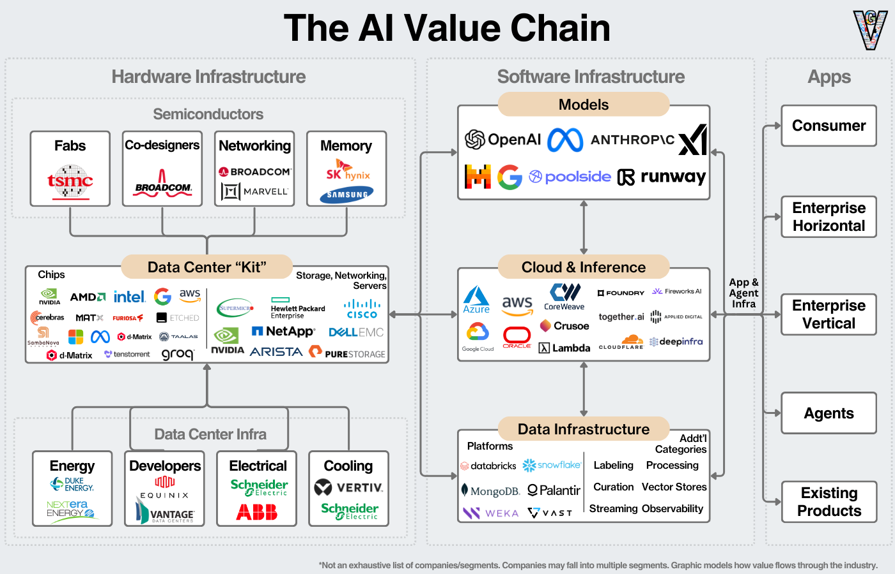
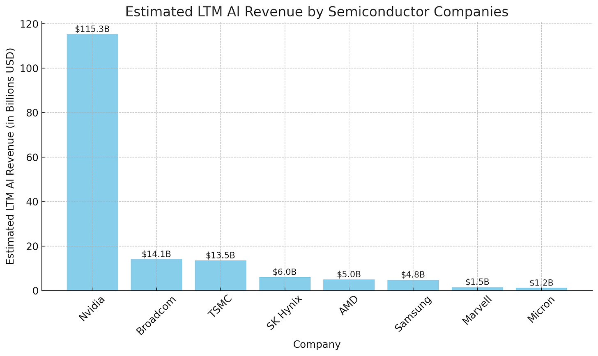
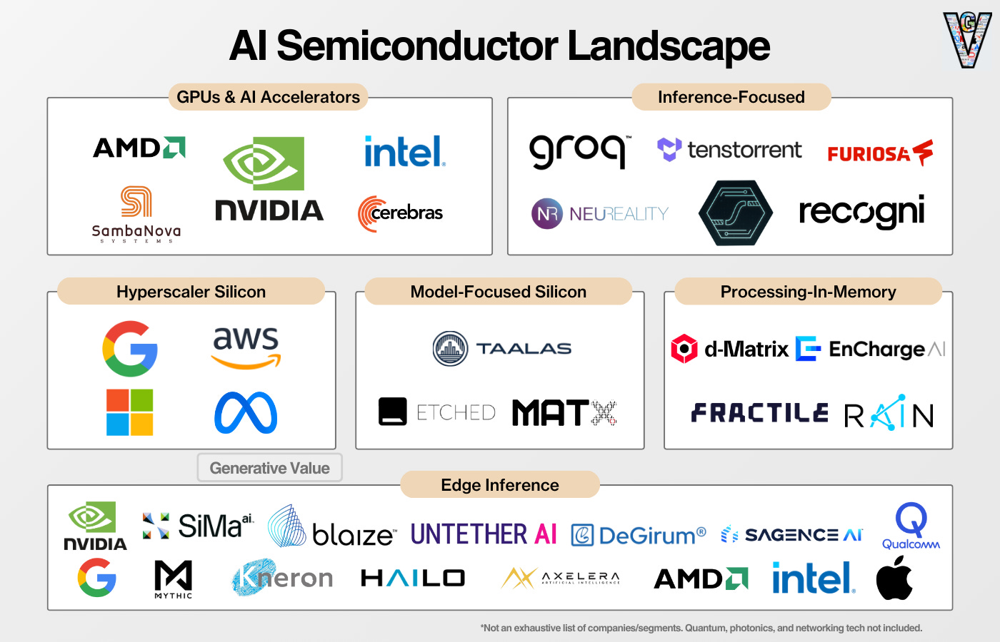
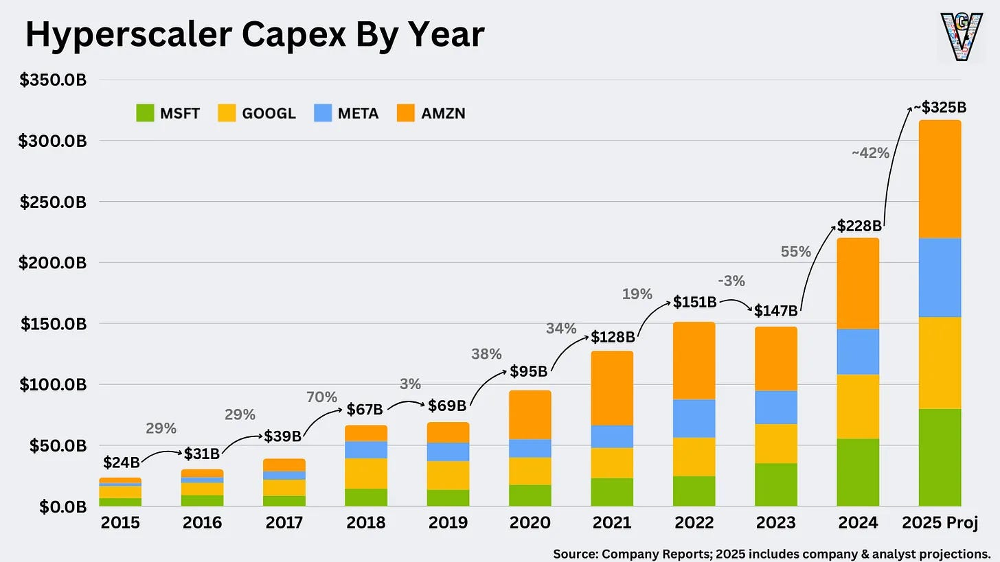
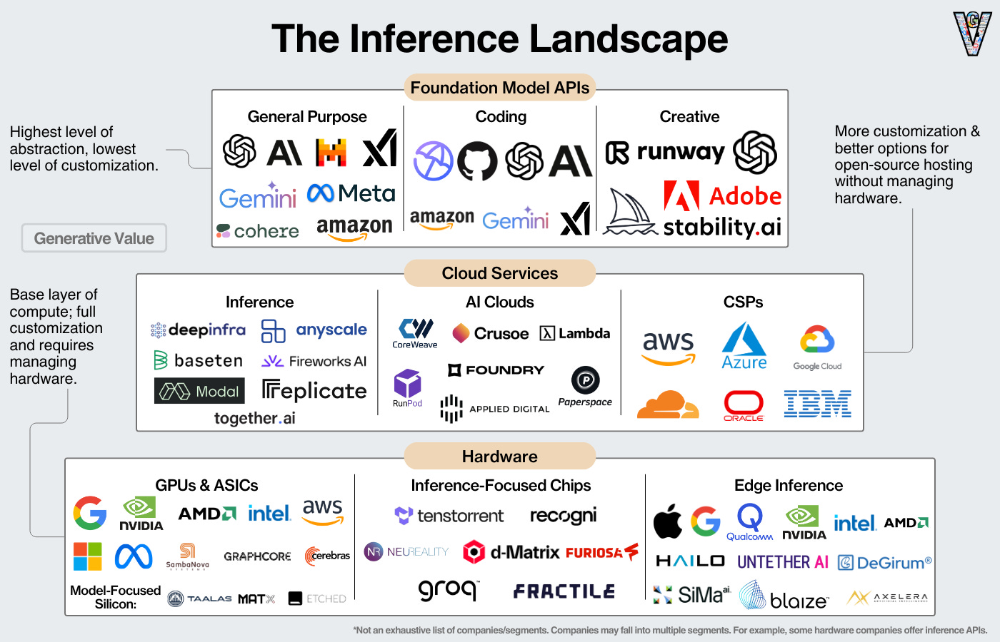
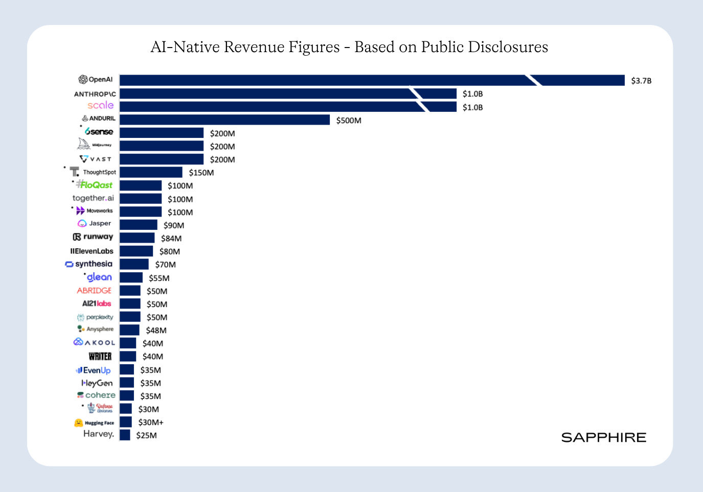
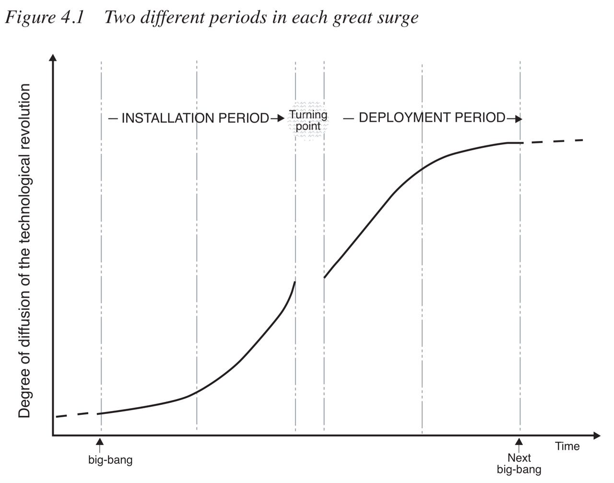
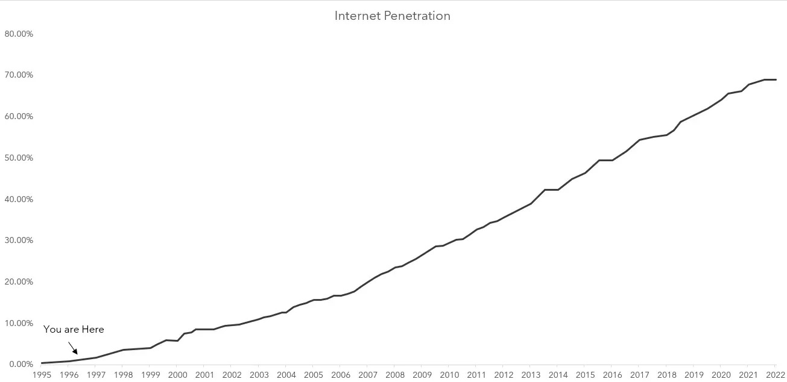

# The Current State of AI Markets

**Author:** Eric Flaningam  
**Publication:** Generative Value  
**Date:** March 9, 2025  
**URL:** https://www.generativevalue.com/p/the-current-state-of-ai-markets-6b3  

---

# The Current State of AI Markets

### The March 2025 edition: A quantitative analysis of where value has accrued; AI Supply and AI Demand; The Long Tail of Applications

Six months ago, I wrote my first Current State of AI Markets. The topic du jour at that time was “ROI on AI.” In it, I essentially said the “ROI on AI” debate was misguided.

There was a different calculation at hand for the largest tech companies in the world. If AI fulfills (or even comes close) to its expectations, the upside (new revenue) and downside (disruption) are tremendous. Additionally, the four hyperscalers (Meta, Google, Microsoft, Amazon) have a combined $351B in cash/marketable securities on their balance sheets.

Carrot + Stick + No Reasonable Alternatives = Play the AI Arms Race

Combined, the risk of underinvesting was dramatically higher than the risk of overinvesting!

Today, that has continued to play out. The hyperscalers project ~$325B in capital expenditures in 2024. However, commentary around these investments have started to shift!

The crux of AI markets today is what happens when AI supply (GPUs, Data Centers, Energy) meets AI demand (Demand for inference, which drives demand for training). Microsoft and Amazon predicted we’d see that start to happen in the second half of this year.

**At that point, we will see the unhindered demand for AI. We’ll get a definitive look at demand for AI solutions today.**

My goal for this article is to provide a quantitative update on where value has accrued thus far and some thoughts on what that means for the industry moving forward.

**As we get into the numbers, they point to one clear conclusion: despite the hundreds of billions spent on infrastructure, we’re so early in the lifecycle of this industry.**

We’ve seen hundreds of billions of investment in hardware infrastructure, laying the foundation for software/application revenue:

[
- ](https://substackcdn.com/image/fetch/$s_!lLNd!,f_auto,q_auto:good,fl_progressive:steep/https%3A%2F%2Fsubstack-post-media.s3.amazonaws.com%2Fpublic%2Fimages%2Fb42a8cf8-21dc-4152-9d0d-1f91834f3417_1400x900.png)I will keep this infrastructure section rather short because we actually have quite a clear idea of where revenue has occurred. Given that many of these companies are public, we also get a quarterly update and qualitative interviews along the way. Secondly, though, infrastructure revenue is very much determined by the latter half of the article: the applications of that infrastructure.### Semiconductors

**In the semiconductor ecosystem, approximately $160B flowed through the major players in the ecosystem in 2024.** Here are my assumptions for that number:Nvidia: $115.3B in data center revenue (fiscal year ending Jan 28, 2025).
- TSMC: ~$13-$14B in AI revenue (fiscal year ending Dec 31, 2024). Quote: *“accounting for close to mid-teens percent of total revenue in 2024.”*
- Broadcom: $14.1B in AI revenue (Q1 ending Feb 2, 2025)
- AMD: >$5B in annual data center AI revenue (fiscal year ending Dec 28, 2024).
- Memory Market:HBM revenue: ~$12B in 2024 (Gartner estimate).
- SK Hynix: ~50% market share, ~$6B in HBM revenue.
- Samsung: ~40% market share, ~$4.8B in HBM revenue.
- Micron: ~10% market share, ~$1.2B in HBM revenue.
- Marvell: >$1.5B in AI revenue (fiscal year ending Feb 1, 2025).
Note: this does double count revenue flowing to TSMC. 

Combined, that gives us revenue estimates below:

[
- ](https://substackcdn.com/image/fetch/$s_!w3De!,f_auto,q_auto:good,fl_progressive:steep/https%3A%2F%2Fsubstack-post-media.s3.amazonaws.com%2Fpublic%2Fimages%2Fd103754f-835a-41f4-be22-fadd7e3aa60e_1600x954.png)Many AI chip startups are taking on the market as well (of which I admire greatly), raising well over $4B collectively:But they haven’t generated revenue at the scale of impacting the overall ecosystem yet.### Data Centers & Cloud Services

One layer down, we have the data center buildout, which continues to grow strongly!Hyperscaler CapEx is the best proxy for data center demand:**If we make the assumption that GPUs make up half of data center costs, that assumes $115B in data center revenue outside of GPUs. **(For context, Coreweave’s S1 reported that 46% of purchases went to one supplier. However, we can get vastly different estimates if we remove GPUs from hyperscaler CapEx and it could be as much as $200B in non-GPU data center investments.)Within data centers, the server OEMs like Dell and SMCI continue to benefit: Dell had about *“$10B of AI-optimized servers in fiscal year 2025”* and SMCI had *“approximately $4B in AI revenue in Q4.”*The other half goes to mechanical, cooling, electrical equipment, and the ongoing expense of energy. One note on energy providers: It’s a clear bottleneck for data centers, but supply just doesn’t scale up that quickly in the energy ecosystem ([more on this problem here](https://www.generativevalue.com/p/ai-data-centers-part-2-energy)).Finally, we have the cloud ecosystem (which is mostly encompassed in the inference cloud services landscape):If we break out revenue in this landscape:Microsoft: ~$12B AI revenue run rate (primarily from cloud, $1.5B-$2B likely from applications)
- Amazon & Google: Estimated at “a multi-billion dollar” AI revenue run rate each.
- Oracle: Signed $12.5B in new AI contracts last June. Estimated to generate at least a few billion in AI revenue in 2024, with a minimum of ~$1B per quarter from new AI business alone.
- AI Neoclouds: the large AI Neoclouds generated approximately $3B in revenue in 2024.
**Combined, that generates ~$20B-$25B in revenue from the cloud providers. **Accounting for revenue from additional cloud and AI neoclouds, I’ll shy on the upper half of that boundary at $25B.

## Foundation Models & AI Applications

While the infrastructure landscape is fairly well laid out today, the application landscape is a world of possibility! Much of the investments in this landscape come from private investors and venture capital, an industry built on investing in possibility!

Based on public info, here’s a good estimate of revenue by “AI-Native” Companies:

[
- ](https://substackcdn.com/image/fetch/$s_!orEu!,f_auto,q_auto:good,fl_progressive:steep/https%3A%2F%2Fsubstack-post-media.s3.amazonaws.com%2Fpublic%2Fimages%2Fcd21930f-bb81-4e56-9b4e-cfa94d665c32_1375x963.png)[Source.](https://sapphireventures.com/blog/top-10-ai-trends-predictions-for-2025-a-platform-shift-in-the-making/)OpenAI and Anthropic were estimated at $3.7B and $400M-$500M in 2024 revenue. Image/video generation model companies $80M+ in revenue run rate, and voice models like ElevenLabs and Sythesia are estimated at $70M+ in run rate.Data infrastructure companies are doing hundreds of millions in revenue like Scale (Expected $1B in revenue in 2024) and Vast ($200M ARR in Dec 2023). Data platforms like Snowflake, Databricks, and Palantir all have billions in revenue tangential to AI, but it’s hard to distinguish what directly comes from AI revenue.This is incredible for startups! But we’re far from hitting the hundreds in billions in revenue we’ll need to see a positive return on the infrastructure investments.On one hand, we’ve yet to see large scale revenue. On the other hand, the AI tools being created are incredible. They’re making us more productive, automating tasks, and companies are willing to pay millions for those solutions. I can’t help but be reminded of Steve Jobs “computers are the bicycles of the mind” quote. I guess AI is like the motorcycle of the mind?## Infrastructure Buildouts & The Long Tail of Applications

At this point, we’ve seen truly massive infrastructure investments for AI (hundreds of billions of dollars, perhaps only rivaled by the telecom build-out of the 90s).We’ve seen incredible growth of AI applications, but technology can only be digested so fast!In Carlota Perez’ *Technological Revolutions and Financial Capital*, she lays out the lifecycle of technological diffusion (adoption).As she describes:*As shown in Figure 4.1, the first half can be termed the installation period. It is the time when the new technologies irrupt in a maturing economy and advance like a bulldozer disrupting the established fabric and articulating new industrial networks, **setting up new infrastructures and spreading new and superior ways of doing things.***Now, let me give you the quote that really matters:***At the beginning of that period, the revolution is a small fact and a big promise**; at the end, the new paradigm is a significant force, having overcome the resistance of the old paradigm and being ready to serve as propeller of widespread growth.*…it’s worth reading that twice. So, to summarize the Current State of AI Markets, let me lay out approximate revenue by category in AI over the last year:Semiconductor Ecosystem: ~$160B
- Data Center Infrastructure: Very roughly ~$115B (assuming half the costs of AI data centers are GPUs; according to Coreweave’s S1, 46% of their purchases went to Nvidia.)
- Cloud Revenue: ~$25B
- Foundation Models & AI Applications: <$10B
I’ll end the way I ended my last Current State of AI Markets:

*As Doug O’Laughlin [pointed out](https://substack.com/@mule/p-147002564), we’re in the very early stages of AI:*

*New technologies are hard to figure out, especially in the short term. And that’s okay. Value will be created in unforeseen ways. Over the long run, betting against technology is a bad bet to make; and certainly won’t be one I’m making.*

Thanks for reading Generative Value! Subscribe for free to receive new posts and support my work.

SubscribeAs always, thanks for reading!

*Disclaimer: The information contained in this article is not investment advice and should not be used as such. Investors should do their own due diligence before investing in any securities discussed in this article. While I strive for accuracy, I can’t guarantee the accuracy or reliability of this information. This article is based on my opinions and should be considered as such, not a point of fact. Views expressed in posts and other content linked on this website or posted to social media and other platforms are my own and are not the views of Felicis Ventures Management Company, LLC.*

